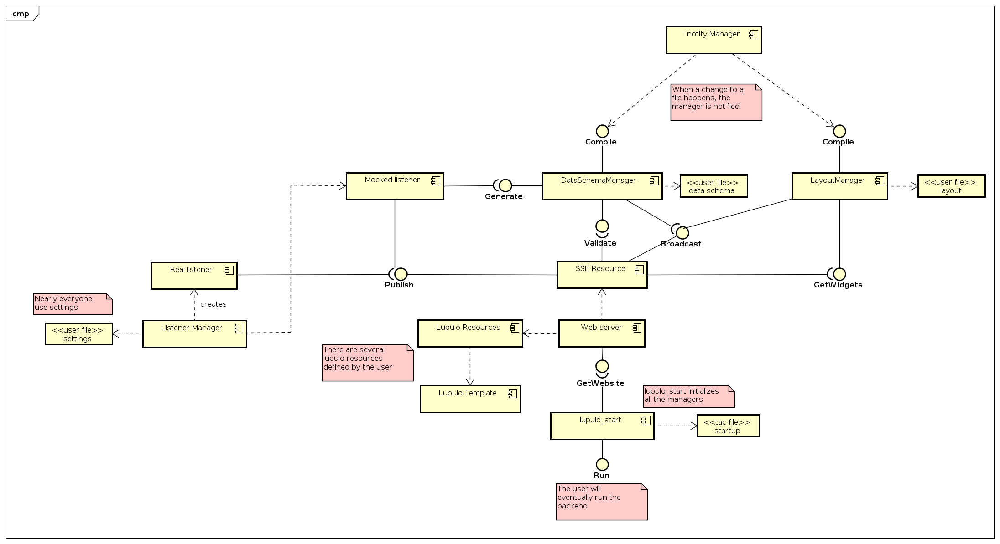
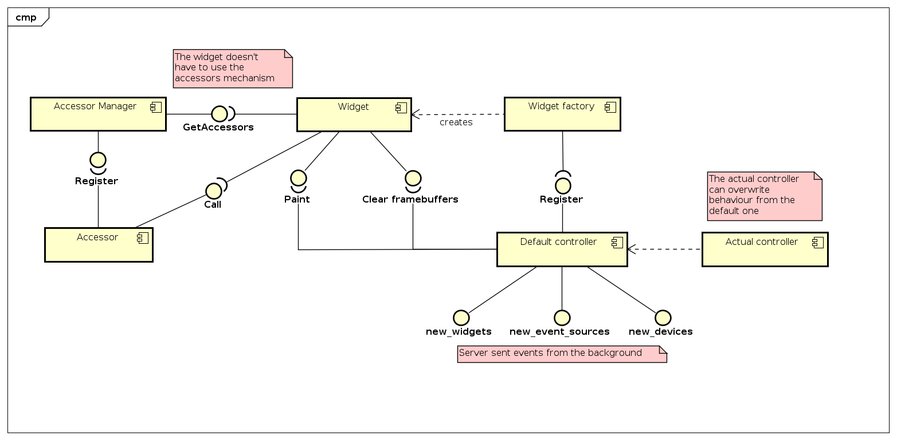

Architecture
============

As explained in the :ref:`overview`, the project is made of two main components,
the *backend* and the *frontend*.

The frontend and backend will communicate through two main interfaces:

#. Asynchronous data interface: used to push information from the backend to the
   frontend once it arrives to the backend from the device.
#. C&C interface: used to command the device from the frontend.

Apart from this two interfaces, the backend will communicate with the device
through a dynamic data link connection chosen by the user. This way m3dpi_ui
provides an abstraction layer that doesn't fix the way the backend communicates
with the device.

    UML deployment diagram for the general configuration

Backend
-------

The backend has three main responsibilities:

#. Setup a data link connection with the device.
#. Manage the information sent by the device to the backend.
#. Compile the layout.
#. Provide the C&C listening interface.

As said above, the data link connection between the backend and the device is
constructed dynamically. The user configures the data link connection in the
main configuration file of m3dpi_ui and a proper data link is built accordingly
to that simple description.

To allow a more greater personalization, the user can program a factory for data
link connections, register that factory into the framework, configure the
settings file to use that new factory and ultimately use the new data link
connection in h{is,er} project.

Once the backend has created the data link connection, all the data the device 
is sending downwards will be received by the backend. This information will be
validated against the data schema that the user provides. If the information
respects the data schema definition, it will be sent downwards to the frontend
through an asynchronous data connection.

This asynchronous data connection is provided by Server-Sent Events, an HTML5
technology that allow a web server to push information to a client without the
need of a previous client request.

The data sent by the backend to the frontend is made of the processed data of
the device plus some housekeeping data. The housekeeping data is internal to the
project and cannot be modified by the user of the framework.

Due to the hierarchical nature of the layout, before it's sent to the device
through the housekeeping data, it first needs to be compiled. This compilation
is only done once per layout and afterwards is sent to the frontend.

The C&C listening end will be provided by some http resources associated to a
url schema that respects the RESTful core goals.

    UML components diagram for the backend

Frontend
--------

The frontend has the responsibility to:

#. Load the layout and construct the widgets.
#. Render the webpage.

Once the layout is received from the backend through the asynchronous data link,
the frontend constructs every widget and place them in the web page in a dynamic
way.

From now on, every widget will get a notification when some data is received
for the event sources that the widget is listening on. Once data arrives for a
widget, the frontend will call it to render itself into the page with the new
data.

    UML components diagram for the frontend
