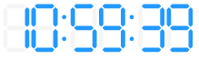

.. _digital_clock:

DigitalClock
============

DigitalClock is a widget that displays some time information using the digital
display widget as shown in the following image:

It provides dynamic sizing and defines the following requirement:

device_time
-----------

A boolean that will grab the information from the jdata sent to its paint event
if it's set to true or that will render the real time from the browser client if
set to false.

example
-------

The following is a correct layout for the DigitalClock widget::

    {
        "clock": {
            "type": "digital_clock",
            "size": {
                "height": 100
            },
            "margin": {
                "top": 0,
                "bottom": 0,
                "left": 0,
                "right": 0
            },
            "event_names": ["date"],
            "anchor": "#clock-anchor",
            "accessors": [{
                "type": "primitive"
            }],
            "device_time": false
        },
    }
