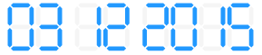

.. _digital_date:

DigitalDate
===========

DigitalDate is a widget that displays some time information using the digital
display widget as shown in the following image:

It provides dynamic sizing and defines one argument.

format
------

A string which establishes the format of the date. It is composed of literals
separated by a slash. The accepted literals are "YYYY" for year, "DD" for day
and "MM" for month.

example
-------

The following is a correct layout for the DigitalDate widget::

    {
        "date": {
            "type": "digital_date",
            "size": {
                "height": 100
            },
            "margin": {
                "top": 0,
                "bottom": 0,
                "left": 0,
                "right": 0
            },
            "event_names": ["date"],
            "anchor": "#date-anchor",
            "accessors": [{
                "type": "primitive"
            }],
            "format": "DD/MM/YYYY"
        },
    }
