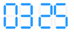

.. _digital_display:

DigitalDisplay
==============

This widget displays a set of numbers in a 7 segments display as can be seen in
the image:

DigitalDisplay uses the accessors mechanism, it expects to use as much accessors
as the sum of its digits section, so you need to define the accessors as a list.

It also provides dynamic sizing so you only need to set one of the sizes of the
widget (height or width) and the widget will fill the other size with a number
that preserves the aspect ratio of the widget.

The obligatory attributes for the layout are:

digits
------

A list with the total groups of digits and how many digits are in each group.
For example, to show two groups of numbers with 2 digits in the first and 3
digits in the second you should write::

    digits: [2, 3]

separator
---------

Boolean to show if the widget should print a separator between the groups of
digits or not.

example
-------

The following is a correct layout for the DigitalDisplay widget::

    {
        "battery": {
            "type": "digital_display",
            "size": {
                "height": 100
            },
            "margin": {
                "top": 0,
                "bottom": 0,
                "left": 0,
                "right": 0
            },
            "event_names": ["battery-list"],
            "anchor": "#battery-anchor",
            "accessors": [{
                "type": "index",
                "start": 0,
                "end": 3
            }],
            "digits": [3],
            "separator": false
        },
    }
