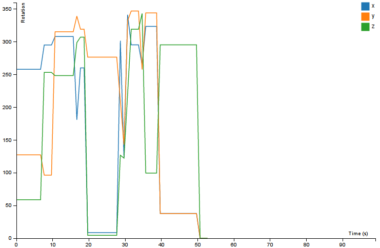

.. _multiline:

MultiLine
---------

MultiLine is a widget that displays numeric information in a line graph with
multiple lines if necessary as can be seen in the image:

The obligatory attributes for the layout are:

name_lines
::::::::::

List containing the names of the lines rendered by the widget. This list is used
to know how many lines are going to be rendered and for the legend of the graph.

y_name
::::::

String for the name that will be displayed in the y axis of the graph.

seconds
:::::::

Length of the time axis.

range
:::::

Domain of the data.

example
:::::::

The following is a correct layout for the MultipleLine widget::

    {
        "global": {
            "abstract": true,
            "type": "multiple_line",
            "size": {
                "width": 760,
                "height": 500
            },
            "seconds": 100
        },

        "battery": {
            "parent": "global",
            "event_name": "battery",
            "anchor": "#battery",
            "name_lines": ["Battery"],
            "y_name": "Battery",
            "accessors": [{
                "name": "index",
                "start": 0,
                "end": 1
            }],
            "range": [0, 100]
        },
    }
